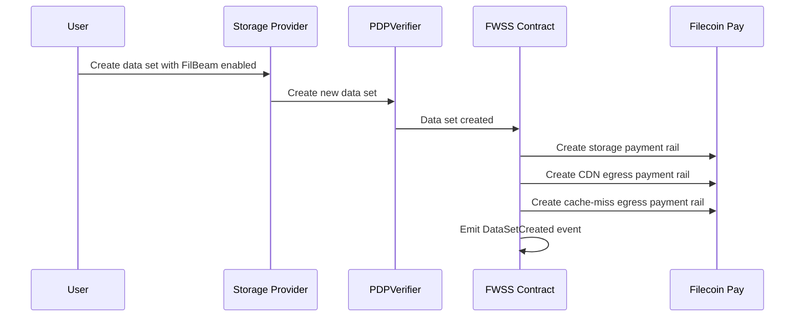
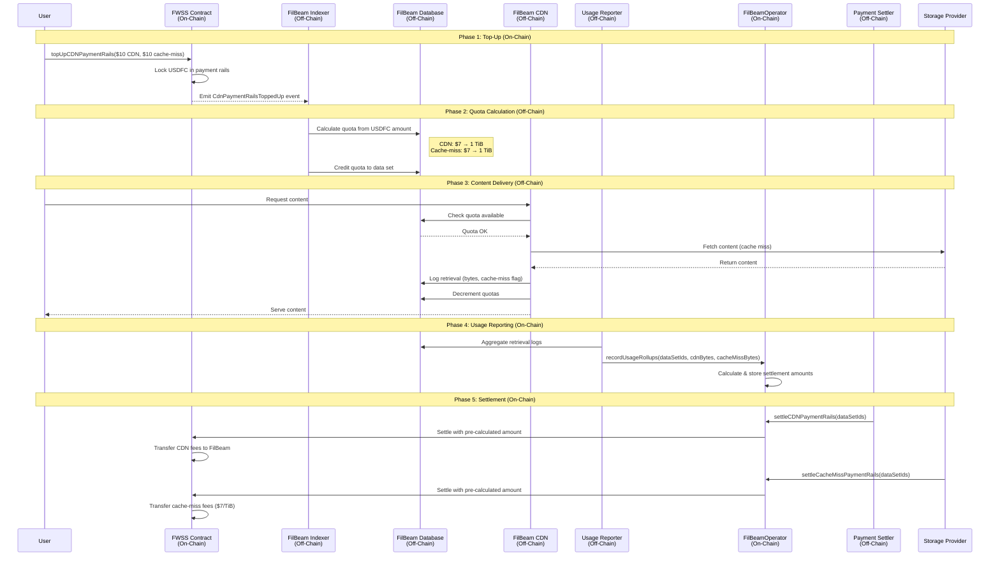
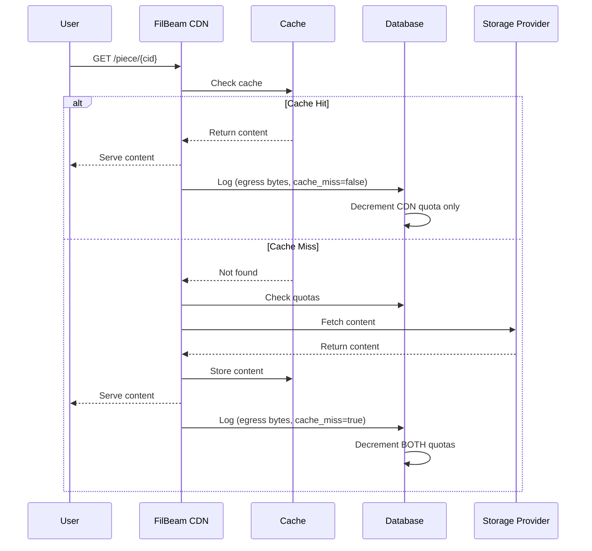
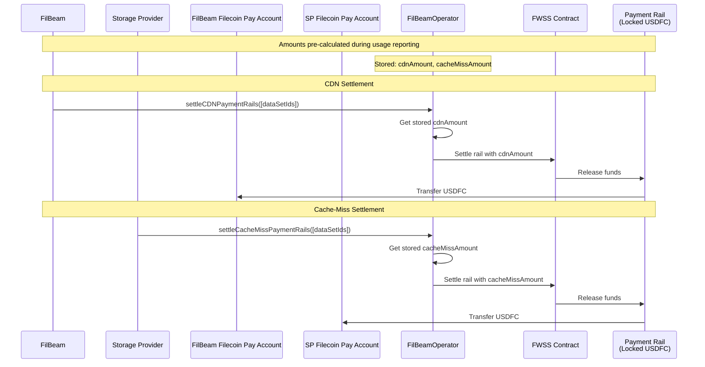
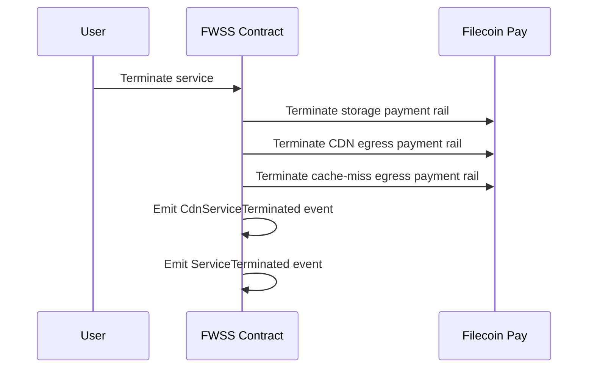

# Payment Model

This document explains how FilBeam's pay-per-byte payment model works, including the complete flow from on-chain top-up to settlement.

## Overview

FilBeam uses a **hybrid on-chain/off-chain model**:

- **On-chain**: Top-ups, usage reporting, and settlement
- **Off-chain**: Quota calculation, caching, request serving, and usage tracking

This design provides usage and payment transparency while maintaining high performance for content delivery.

## Payment Rails Setup

When a data set is created with FilBeam enabled, the FWSS contract creates three payment rails:



| Payment Rail | Payer | Payee | Purpose |
|--------------|-------|-------|---------|
| Storage | User | Storage Provider | Ongoing storage costs |
| CDN Egress | User | FilBeam | CDN delivery fees |
| Cache-Miss Egress | User | Storage Provider | Retrieval from origin |

## Complete Payment Flow



## Phase 1: Top-Up (On-Chain)

The user tops up their FilBeam payment rails by calling the FWSS contract's `topUpCDNPaymentRails` method with the desired USDFC amounts for CDN and cache-miss rails.

**What happens on-chain:**
1. USDFC is locked in payment rails (CDN rail + cache-miss rail)
2. Contract emits `CDNPaymentRailsToppedUp` event with amounts
3. Funds are reserved but not yet transferred to anyone

See [Top Up CDN Quota](../how-to/top-up-cdn-quota.md) for step-by-step instructions.

## Phase 2: Quota Calculation (Off-Chain)

The FilBeam Indexer receives the blockchain event and calculates quotas:

```
CDN Quota (bytes) = (USDFC amount × BYTES_PER_TIB) / CDN_RATE
Cache Miss Quota (bytes) = (USDFC amount × BYTES_PER_TIB) / CACHE_MISS_RATE
```

Where:
- `BYTES_PER_TIB` = 1,099,511,627,776 (1024^4)
- `CDN_RATE` = 7 × 10^18 (with 18 decimals = $7)
- `CACHE_MISS_RATE` = 7 × 10^18 (with 18 decimals = $7)

**Both rails have the same $7/TiB rate.** The $14/TiB effective cost for cache misses comes from being charged on BOTH rails simultaneously.

**Example: $7 CDN + $7 cache-miss top-up**
```
CDN Quota = (7 × 10^18 × 1,099,511,627,776) / (7 × 10^18)
          = 1,099,511,627,776 bytes
          = 1 TiB

Cache Miss Quota = (7 × 10^18 × 1,099,511,627,776) / (7 × 10^18)
                 = 1,099,511,627,776 bytes
                 = 1 TiB
```

The updated quota is stored in FilBeam's D1 database.

## Phase 3: Content Delivery (Off-Chain)

When users request content, FilBeam serves it and tracks usage:



**Quota deduction rules:**

| Request Type | CDN Quota | Cache Miss Quota |
|--------------|-----------|------------------|
| Cache Hit | -N bytes | unchanged |
| Cache Miss | -N bytes | -N bytes |

Each request is logged to D1 for future processing.

## Phase 4: Usage Reporting (On-Chain)

Periodically, the Usage Reporter aggregates logs and reports usage to the blockchain via `FilBeamOperator.recordUsageRollups`. This records both CDN bytes (total egress) and cache-miss bytes (storage provider compensation) for each data set.

**Reporting schedule:**
- Calibration testnet: Every 30 minutes
- Mainnet: Every 4 hours

See [Usage Reporting](usage-reporting.md) for details on what gets reported and why.

## Phase 5: Settlement (On-Chain)

Settlement transfers funds from payment rails to **recipient's Filecoin Pay account**. Both FilBeam and storage providers call the **FilBeamOperator** contract to settle their respective rails.

### How Settlement Amounts Are Calculated

Settlement amounts are **pre-calculated during usage reporting** (Phase 4), not during settlement:

```
CDN Amount = reportedCdnBytes × cdnRatePerByte
Cache-Miss Amount = reportedCacheMissBytes × cacheMissRatePerByte
```

These amounts are stored in the contract and accumulate with each usage report. Settlement simply transfers the accumulated amounts.

### CDN Settlement (FilBeam)

FilBeam calls `FilBeamOperator.settleCDNPaymentRails` to claim accumulated CDN fees. The pre-calculated amount is transferred from the payment rail to FilBeam's Filecoin Pay account.

### Cache-Miss Settlement (Storage Providers)

Storage providers call `FilBeamOperator.settleCacheMissPaymentRails` to claim their compensation for serving cache misses. The pre-calculated amount is transferred from the payment rail to the provider's Filecoin Pay account.

### Settlement Flow



### Settlement Details

- **Anyone can call** the settlement methods, but funds go to the designated payee's Filecoin Pay account
- **Partial settlements** are supported if locked funds are insufficient
- **Amounts accumulate** between settlements - no need to settle after every usage report

## Cost Breakdown

Both payment rails charge **$7/TiB**. The effective cost depends on the request type:

| Request Type | CDN Rail | Cache-Miss Rail | Total Cost |
|--------------|----------|-----------------|------------|
| **Cache Hit** | $7/TiB | — | **$7/TiB** |
| **Cache Miss** | $7/TiB | $7/TiB | **$14/TiB** |

The $14/TiB cache-miss cost comes from being charged on BOTH rails:

| Recipient | Amount | Settlement Method |
|-----------|--------|-------------------|
| **FilBeam CDN** | $7/TiB | `settleCDNPaymentRails()` |
| **Storage Provider** | $7/TiB | `settleCacheMissPaymentRails()` |

## On-Chain vs Off-Chain Summary

| Component | Location | Purpose |
|-----------|----------|---------|
| Payment rails | On-chain | Lock funds, guarantee payment |
| Top-up events | On-chain | Trigger quota calculation |
| Quota tracking | Off-chain | Fast request validation |
| Request serving | Off-chain | Low-latency content delivery |
| Usage logging | Off-chain | Track egress for billing |
| Usage reporting | On-chain | Transparent usage records |
| Settlement | On-chain | Transfer funds to recipients |

## Why This Model?

### For Users
- **Predictable costs**: Know exactly what you're paying upfront
- **No surprise bills**: Service stops when quota exhausted
- **Price protection**: Purchased quota keeps its rate
- **Transparent**: All payments and usage on-chain

### For Storage Providers
- **Guaranteed payment**: Funds locked before service
- **Self-service settlement**: Claim earnings anytime
- **Fair compensation**: $7/TiB for actual bytes delivered

### For the Network
- **Decentralized**: No central billing authority
- **Transparent**: All transactions queriable on-chain
- **Trustless**: Smart contracts enforce payment rules

## Service Termination

Currently FilBeam service can only be terminated by terminating the full service (deleting the data set):



## See Also

**Explanations:**
- [Quota System](quota-system.md) - Understanding the dual quota design
- [Usage Reporting](usage-reporting.md) - Why usage is reported on-chain

**How-To Guides:**
- [Top Up CDN Quota](../how-to/top-up-cdn-quota.md) - Step-by-step instructions
- [Monitor Usage](../how-to/monitor-usage.md) - Check your quotas and usage

**Reference:**
- [Pricing](../pricing.md) - Detailed pricing information
