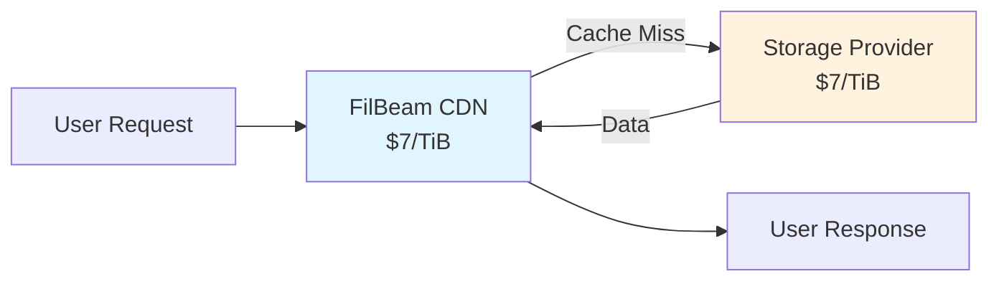
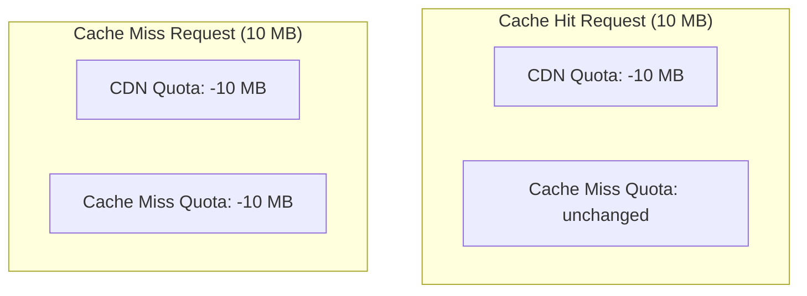

# Quota System

This document explains FilBeam's dual quota system and how it tracks egress consumption.

## Overview

FilBeam uses a **dual quota system** with two separate quotas:

1. **CDN Egress Quota** - Tracks ALL traffic
2. **Cache Miss Egress Quota** - Tracks only cache miss traffic

This design reflects the different costs associated with cache hits versus cache misses.

## Why Dual Quotas?

### The Cost Breakdown

Both payment rails charge **$7/TiB**. The effective cost depends on whether the request is a cache hit or miss:

| Request Type | CDN Rail Charged | Cache-Miss Rail Charged | Total Cost |
|--------------|------------------|-------------------------|------------|
| **Cache Hit** | $7/TiB | — | **$7/TiB** |
| **Cache Miss** | $7/TiB | $7/TiB | **$14/TiB** |

### Understanding Cache Miss Pricing

Cache misses cost $14/TiB because **both quotas are decremented** and both rails are charged:

1. **$7/TiB → CDN Rail** - Charged on ALL requests, pays FilBeam for CDN infrastructure
2. **$7/TiB → Cache-Miss Rail** - Charged ONLY on cache misses, pays Storage Provider for retrieval

This means:
- When you top up $7 to the CDN rail, you get **1 TiB of CDN quota**
- When you top up $7 to the cache-miss rail, you get **1 TiB of cache-miss quota**
- A cache miss consumes from BOTH quotas, so the effective cost is $14/TiB



**Total Cost: $7 (CDN) + $7 (SP) = $14/TiB**

### Why This Matters

- **For Content Owners**: You pay the full $14/TiB for cache misses, but subsequent requests for the same content are cache hits at $7/TiB
- **For Storage Providers**: You earn $7/TiB for every cache miss you serve, incentivizing reliable and fast content delivery

### Quota Design



## How Quotas Work

### Initial State (After Top-Up)

```javascript
// After topping up with $7 CDN + $7 cache-miss
{
  cdnEgressQuota: "1099511627776",        // 1 TiB
  cacheMissEgressQuota: "1099511627776"   // 1 TiB
}
```

Both rails have the same rate:
- $7 → 1 TiB of CDN quota
- $7 → 1 TiB of cache-miss quota

Cache misses consume from BOTH quotas, so the effective cost is $14/TiB.

### After Cache Hit Request

```javascript
// 100 MB file served from cache
{
  cdnEgressQuota: "1099406516224",        // -104,857,600 bytes (100 MB)
  cacheMissEgressQuota: "549755813888"    // unchanged
}
```

### After Cache Miss Request

```javascript
// 100 MB file fetched from provider
{
  cdnEgressQuota: "1099301404672",        // -104,857,600 bytes (100 MB)
  cacheMissEgressQuota: "549650956288"    // -104,857,600 bytes (100 MB)
}
```

## Quota Exhaustion

### What Happens When CDN Quota Runs Out

```
CDN Quota: 0 bytes
Cache Miss Quota: 500 GB

Result: ALL requests blocked with HTTP 402
Message: "CDN egress quota exhausted"
```

Even if you have cache miss quota remaining, you need CDN quota for any request.

### What Happens When Cache Miss Quota Runs Out

```
CDN Quota: 500 GB
Cache Miss Quota: 0 bytes

Result:
  - Cache hits: ALLOWED
  - Cache misses: BLOCKED with HTTP 402
  - Message: "Cache miss egress quota exhausted"
```

You can still serve cached content, but new content cannot be fetched.

## Quota Calculation

### Top-Up Formula

When you top up payment rails:

```javascript
const BYTES_PER_TIB = 1099511627776n  // 1024^4
const RATE_PER_TIB = 7n * (10n ** 18n)  // $7 in USDFC (18 decimals)

// CDN quota from USDFC - $7/TiB
function calculateCDNQuota(usdfcAmount) {
  return (usdfcAmount * BYTES_PER_TIB) / RATE_PER_TIB
}

// Cache miss quota from USDFC - also $7/TiB
function calculateCacheMissQuota(usdfcAmount) {
  return (usdfcAmount * BYTES_PER_TIB) / RATE_PER_TIB
}
```

### Example Calculations

Each rail is $7/TiB independently:

| USDFC Amount | Quota Amount |
|------------|-----------|
| $1 | 146.3 GiB |
| $7 | 1 TiB |
| $14 | 2 TiB |
| $70 | 10 TiB |

**Note:** To serve 1 TiB of cache-miss traffic, you need both 1 TiB CDN quota ($7) AND 1 TiB cache-miss quota ($7) = $14 total.

## Checking Your Quotas

### Using Synapse SDK

```javascript
const stats = await synapse.filbeamService.getDataSetStats(dataSetId)

console.log('CDN Quota:', formatBytes(stats.cdnEgressQuota))
console.log('Cache Miss Quota:', formatBytes(stats.cacheMissEgressQuota))

function formatBytes(bytes) {
  const units = ['B', 'KiB', 'MiB', 'GiB', 'TiB']
  let value = Number(bytes)
  let unitIndex = 0

  while (value >= 1024 && unitIndex < units.length - 1) {
    value /= 1024
    unitIndex++
  }

  return `${value.toFixed(2)} ${units[unitIndex]}`
}
```

### Using Stats API

```bash
curl https://stats.filbeam.io/data-set/12345
```

```json
{
  "cdnEgressQuota": "1099511627776",
  "cacheMissEgressQuota": "549755813888"
}
```

## Quota Management Strategies

### Strategy 1: Default split

Top up both quotas based on the initial 70/30 split:

```javascript
const cdnAmount = parseUnits('7', 18)        // $7
const cacheMissAmount = parseUnits('3', 18)  // $3

await synapse.warmStorageService.topUpCDNPaymentRails(dataSetId, {
  cdnAmount,
  cacheMissAmount
})

// Results in:
// CDN: ~1.43 TiB
// Cache Miss: ~0.71 TiB
```

### Strategy 2: Frequently accessed content

If you expect your content to be frequently accessed:

```javascript
// More CDN quota, less cache miss quota
const cdnAmount = parseUnits('9', 18)        // $9
const cacheMissAmount = parseUnits('1', 18)   // $1

// Optimized for frequently accessed content
```

### Strategy 3: Infrequently accessed content

If you expect your content to be infrequently accessed:

```javascript
// Equal dollar amounts = more cache miss capacity
const cdnAmount = parseUnits('10', 18)        // $5
const cacheMissAmount = parseUnits('10', 18)  // $5

// Good for content that's accessed infrequently
```

## Monitoring Quota Health

### Health Check Function

```javascript
async function checkQuotaHealth(dataSetId) {
  const stats = await synapse.filbeamService.getDataSetStats(dataSetId)

  const cdnGiB = Number(stats.cdnEgressQuota) / (1024 ** 3)
  const cacheMissGiB = Number(stats.cacheMissEgressQuota) / (1024 ** 3)

  const warnings = []

  // Check CDN quota
  if (cdnGiB <= 0) {
    warnings.push({ severity: 'critical', message: 'CDN quota exhausted' })
  } else if (cdnGiB < 10) {
    warnings.push({ severity: 'warning', message: `CDN quota low: ${cdnGiB.toFixed(2)} GiB` })
  }

  // Check cache miss quota
  if (cacheMissGiB <= 0) {
    warnings.push({ severity: 'critical', message: 'Cache miss quota exhausted' })
  } else if (cacheMissGiB < 5) {
    warnings.push({ severity: 'warning', message: `Cache miss quota low: ${cacheMissGiB.toFixed(2)} GiB` })
  }

  return {
    healthy: warnings.length === 0,
    warnings,
    quotas: { cdnGiB, cacheMissGiB }
  }
}
```

### Automated Alerts

```javascript
const THRESHOLDS = {
  cdnWarning: 50,      // GiB
  cdnCritical: 10,     // GiB
  cacheMissWarning: 25, // GiB
  cacheMissCritical: 5  // GiB
}

async function monitorQuotas(dataSetId) {
  const health = await checkQuotaHealth(dataSetId)

  for (const warning of health.warnings) {
    if (warning.severity === 'critical') {
      await sendPagerDutyAlert(warning.message)
    } else {
      await sendSlackNotification(warning.message)
    }
  }
}

// Run every 5 minutes
setInterval(() => monitorQuotas(dataSetId), 5 * 60 * 1000)
```

## Database Schema

Quotas are stored in the `data_set_egress_quotas` table:

```sql
CREATE TABLE data_set_egress_quotas (
    data_set_id TEXT PRIMARY KEY,
    cdn_egress_quota INTEGER DEFAULT 0,
    cache_miss_egress_quota INTEGER DEFAULT 0
);
```

### Quota Updates

**On Top-Up:**
```sql
INSERT INTO data_set_egress_quotas (data_set_id, cdn_egress_quota, cache_miss_egress_quota)
VALUES (?, ?, ?)
ON CONFLICT(data_set_id) DO UPDATE SET
  cdn_egress_quota = cdn_egress_quota + excluded.cdn_egress_quota,
  cache_miss_egress_quota = cache_miss_egress_quota + excluded.cache_miss_egress_quota;
```

**On Request:**
```sql
UPDATE data_set_egress_quotas
SET
  cdn_egress_quota = cdn_egress_quota - ?,
  cache_miss_egress_quota = cache_miss_egress_quota - CASE WHEN ? THEN ? ELSE 0 END
WHERE data_set_id = ?;
```

## FAQ

### Why do I need both quotas?

The dual quota system ensures fair pricing and proper compensation:
- Cache hits cost $7/TiB (CDN cost only)
- Cache misses cost $14/TiB ($7 CDN + $7 storage provider compensation)

The cache miss quota specifically tracks what storage providers have earned and ensures they get paid for their bandwidth.

### What if I run out of cache miss quota but have CDN quota?

Cached content continues to be served, but new content cannot be fetched. Users will get:
- Cache hits: Normal response
- Cache misses: HTTP 402 error

### Can I convert one quota type to another?

No. Each quota type is purchased separately and serves a different purpose. Top up the specific quota you need.
