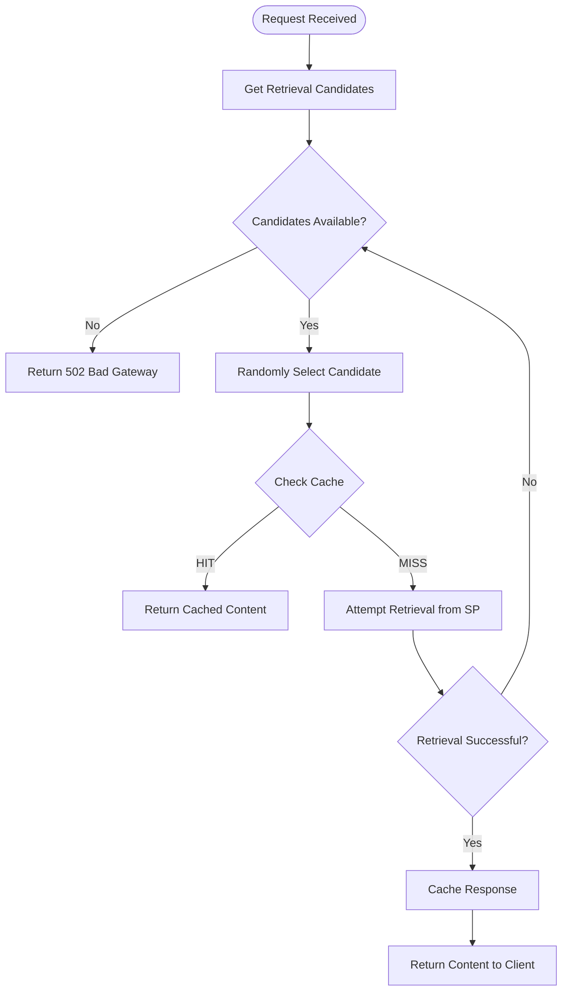

# Content Retrieval and Storage Provider Fallback

FilBeam doesn't rely on a single storage provider to serve content. When a retrieval request arrives, the system identifies all eligible providers that have deals with the payer specified in the retrieval URL and can serve the requested piece. Using a resilient strategy with automatic failover, FilBeam ensures high availability even when individual storage providers experience downtime.

Understanding this architecture helps explain why FilBeam maintains content availability without requiring clients to manage failover logic themselves.

## How Retrieval Candidates Are Selected

When FilBeam receives a retrieval request, it performs a multi-stage filtering process to identify all valid **retrieval candidates**—storage providers that can be attempted to fetch content from.

### The Filtering Pipeline

The filtering pipeline selects retrieval candidates based on multiple factors:

1. **Deal available** — Pick SPs that have active deals for given piece and payer

2. **CDN enabled** — Keep only deals where `"withCDN": true` exists in meta data

3. **Payer compliance** — The payer wallet address must not be sanctioned

4. **Provider eligible** — Only Filecoin Onchain Cloud-approved service providers qualify to serve content

5. **Quota limits met** — Both CDN egress and cache-miss quotas must have remaining capacity

6. **Piece compliance** — The piece CID must not be part of https://badbits.dwebops.pub/

All `(SP,piece)` tuples that pass **all** filters become retrieval candidates.

### Why Multiple Candidates?

A single piece CID may have multiple retrieval candidates because:

- **Multiple Replicas**: The same content may be stored with different service providers for redundancy.
- **Multiple Deals**: The same payer may have multiple deals for the same content, with different or even the same service provider.

This redundancy enables the fallback mechanism described below.

## The Retrieval and Retry Mechanism

Once candidates are identified, FilBeam attempts to retrieve the content using a **random selection with exhaustive retry** strategy:

### Key Design Decisions

**Random Selection**: Rather than using a fixed priority order, FilBeam randomly selects from available candidates. This provides natural load balancing across storage providers and prevents a single "primary" provider from becoming a bottleneck. Additionally, it helps with distributing egress fees among multiple providers.

**Immediate Retry**: When a retrieval attempt fails, the system immediately tries the next candidate without any backoff delay. This minimizes latency for end users—if one SP is down, the failover happens in milliseconds.

**Fallback on Failure**: When retrieval fails, the system tries other candidates until one succeeds. Only if all candidates fail does it return an error.

**No Duplicate Attempts**: Once a retrieval candidate fails, that specific candidate is removed from the pool.

### What Triggers a Retry?

A retry occurs when:

- **HTTP Error Response**: Any 4xx or 5xx status code from the storage provider
- **Network Error**: Connection timeouts, DNS failures, or other network issues
- **Exceptions**: Any unexpected error during the fetch operation

A retry does **not** occur when:

- **Success**: HTTP 2xx responses end the retry loop immediately
- **Candidates Exhausted**: No more providers to try

### Failure Response

If all candidates fail, FilBeam returns a `502 Bad Gateway` response. The response includes debugging information about which providers were attempted, helping operators diagnose availability issues.

## Billing and Usage Accounting

Usage is tracked regardless of which storage provider ultimately serves the content:

| Scenario | Egress Counted | SP Credited |
|----------|----------------|-------------|
| Cache hit | Yes (CDN egress) | None |
| Cache miss, SP1 succeeds | Yes (CDN + cache-miss egress) | SP1 |
| Cache miss, SP1 fails, SP2 succeeds | Yes (CDN + cache-miss egress) | SP2 |
| All SPs fail | No egress | None |

The `X-Data-Set-ID` response header indicates which data set (and thus which deal/payer relationship) was used for the successful retrieval.

## Why This Architecture Simplifies Client Integration

The retrieval design shifts complexity from clients to FilBeam. Rather than requiring applications to maintain provider lists, implement retry logic, or manage failover, FilBeam handles these concerns internally.

This means a single retrieval URL (`https://{payer-address}.filbeam.io/piece/{piece-cid}`) works regardless of which storage provider ultimately serves the content. The payer address in the URL determines which deals are eligible, and the system handles provider selection automatically.

The tradeoff is latency predictability: first-request latency may vary depending on how many providers need to be tried before one succeeds.

## Summary

FilBeam prioritizes availability over strict provider consistency. By treating eligible providers as interchangeable candidates and exhaustively attempting retrieval before failing, the system maximizes content availability while abstracting provider-level concerns from client applications.
