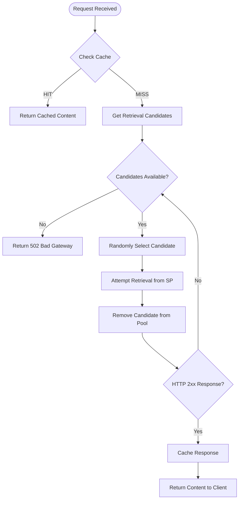

# Content Retrieval and Service Provider Fallback

FilBeam doesn't rely on a single storage provider to serve content. When a retrieval request arrives, the system identifies all eligible providers that have deals with the payer specified in the retrieval URL and can serve the requested piece. Using a resilient strategy with automatic failover, FilBeam ensures high availability even when individual storage providers experience downtime.

Understanding this architecture helps explain why FilBeam maintains content availability without requiring clients to manage failover logic themselves.

## How Retrieval Candidates Are Selected

When FilBeam receives a retrieval request, it performs a multi-stage filtering process to identify all valid **retrieval candidates**—storage providers that can legitimately serve the requested content.

### The Filtering Pipeline

The filtering pipeline validates requests across several dimensions:

1. **Content availability** — The requested piece must exist and be hosted by at least one active service provider.

2. **Payment authorization** — The payer (identified in the retrieval URL) must have an active deal that covers this piece with CDN delivery enabled.

3. **Compliance** — The payer wallet must pass OFAC sanctions screening.

4. **Provider readiness** — Each service provider must have a verified, approved service URL.

5. **Quota limits** — Both CDN egress and cache-miss quotas must have remaining capacity (when enforced).

Only pieces that pass **all** filters become retrieval candidates. Each filter serves a distinct purpose: content filters ensure the data exists, payment filters enforce commercial agreements, compliance filters satisfy regulatory requirements, and quota filters prevent overuse.

### Why Multiple Candidates?

A single piece CID may have multiple retrieval candidates because:

- **Multiple Replicas**: The same content may be stored with different service providers for redundancy.
- **Multiple Deals**: Different payers may have deals for the same content, each with their own service provider relationships.

This redundancy enables the fallback mechanism described below.

## The Retrieval and Retry Mechanism

Once candidates are identified, FilBeam attempts to retrieve the content using a **random selection with exhaustive retry** strategy:

### Key Design Decisions

**Random Selection**: Rather than using a fixed priority order, FilBeam randomly selects from available candidates. This provides natural load balancing across storage providers and prevents a single "primary" provider from becoming a bottleneck.

**Immediate Retry**: When a retrieval attempt fails, the system immediately tries the next candidate without any backoff delay. This minimizes latency for end users—if one SP is down, the failover happens in milliseconds.

**Exhaustive Attempts**: The system tries every available candidate before giving up. If you have three SPs hosting the same content, all three will be attempted before returning an error.

**No Duplicate Attempts**: Once an SP is tried (successfully or not), it's removed from the candidate pool. The system won't retry the same provider within a single request.

### What Triggers a Retry?

A retry occurs when:

- **HTTP Error Response**: Any 4xx or 5xx status code from the storage provider
- **Network Error**: Connection timeouts, DNS failures, or other network issues
- **Exceptions**: Any unexpected error during the fetch operation

A retry does **not** occur when:

- **Success**: HTTP 2xx responses end the retry loop immediately
- **Candidates Exhausted**: No more providers to try

### Failure Response

If all candidates fail, FilBeam returns a `502 Bad Gateway` response. The response includes debugging information about which providers were attempted, helping operators diagnose availability issues.

## Caching Layer

Before contacting any storage provider, FilBeam checks the cache.

When content is found in cache:
- No storage provider is contacted
- No retrieval candidate selection occurs
- The response is served directly from Cloudflare's edge network

When content is fetched from an SP:
- The response is cached for future requests
- Cache TTL is configurable per environment
- Subsequent requests benefit from edge caching

## Billing and Usage Accounting

Usage is tracked regardless of which storage provider ultimately serves the content:

| Scenario | Egress Counted | SP Credited |
|----------|----------------|-------------|
| Cache hit | Yes (CDN egress) | Last SP that populated cache |
| Cache miss, SP1 succeeds | Yes (CDN + cache-miss egress) | SP1 |
| Cache miss, SP1 fails, SP2 succeeds | Yes (CDN + cache-miss egress) | SP2 |
| All SPs fail | No egress | None |

The `X-Data-Set-ID` response header indicates which data set (and thus which deal/payer relationship) was used for the successful retrieval.

## Why This Architecture Simplifies Client Integration

The retrieval design shifts complexity from clients to the platform. Rather than requiring applications to maintain provider lists, implement retry logic, or manage failover, FilBeam handles these concerns internally.

This means a single retrieval URL (`https://{payer-address}.filbeam.io/piece/{piece-cid}`) works regardless of which storage provider ultimately serves the content. The payer address in the URL determines which deals are eligible, and the system handles provider selection automatically.

The tradeoff is latency predictability: first-request latency may vary depending on how many providers need to be tried before one succeeds. However, once content is cached at the edge, subsequent requests bypass the provider selection entirely.

## Summary

FilBeam prioritizes availability over strict provider consistency. By treating eligible providers as interchangeable candidates and exhaustively attempting retrieval before failing, the system maximizes content availability while abstracting provider-level concerns from client applications.
