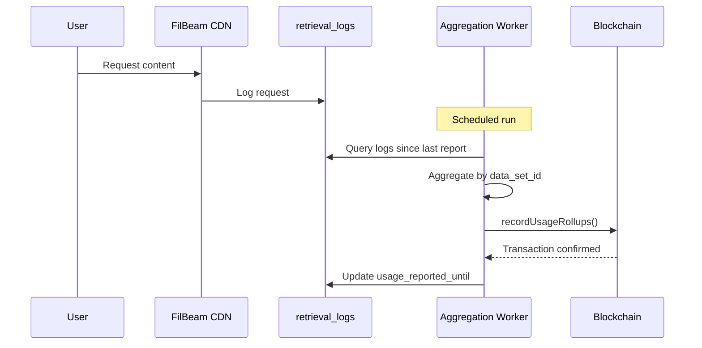
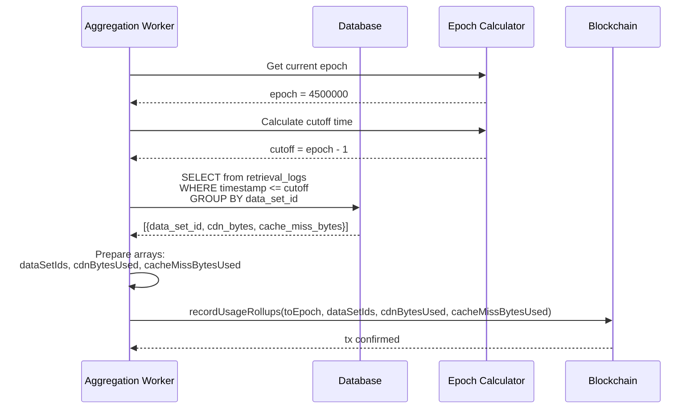
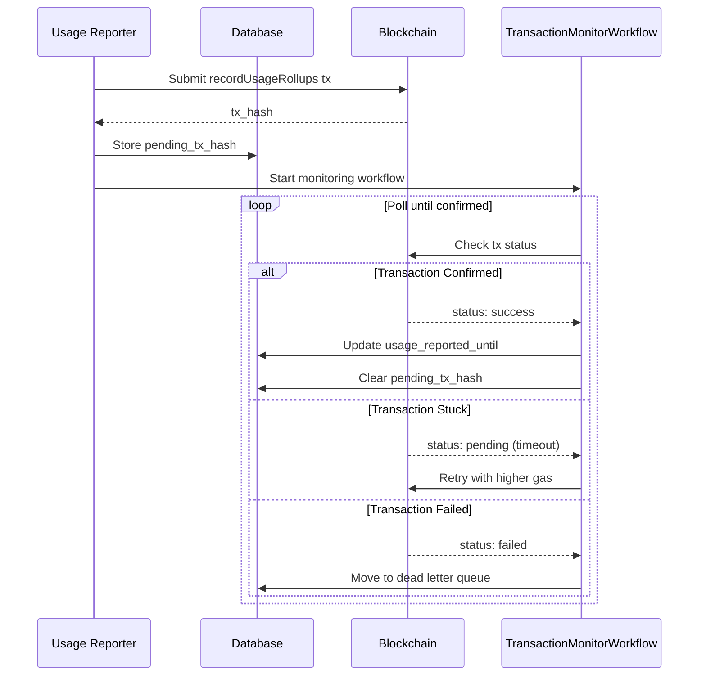

# Usage Reporting

This document explains how FilBeam reports CDN usage to the blockchain for transparent billing.

## Overview

FilBeam records all egress usage on the Filecoin blockchain. This ensures:

- **Transparency**: All usage data is publicly verifiable
- **Accuracy**: Storage providers can verify reported usage matches their delivery logs



## Important Caveat

**Only traffic proxied through FilBeam is reported on-chain.**

If users retrieve content directly from storage providers (bypassing FilBeam), that traffic is:
- NOT recorded in FilBeam's database
- NOT reported to the blockchain
- NOT subject to FilBeam billing

This is by design - FilBeam only bills for traffic it actually serves.

## Data Collection

### What Gets Logged

Every retrieval request through FilBeam is logged to the `retrieval_logs` table:

| Field | Description |
|-------|-------------|
| `timestamp` | When the request occurred |
| `data_set_id` | Which dataset was accessed |
| `egress_bytes` | Total bytes served to client |
| `cache_miss` | Whether content was fetched from storage provider |
| `cache_miss_response_valid` | Whether the cache miss response was valid |
| `request_country_code` | Origin country of the request |
| `bot_name` | Bot identifier (if applicable) |

### What's Excluded from Billing

- **Bot traffic**: Requests with `bot_name` set are logged but excluded from usage reports
- **Invalid responses**: Cache misses where `cache_miss_response_valid = false` don't count toward cache miss bytes
- **Failed requests**: Only responses with `egress_bytes > 0` are counted

## Aggregation Process

FilBeam runs a scheduled worker that aggregates usage data:

### Schedule

| Network | Frequency |
|---------|-----------|
| Calibration | Every 30 minutes |
| Mainnet | Every 4 hours |

### Aggregation Logic



The aggregation query:
1. Selects logs since last `usage_reported_until` timestamp
2. Groups by `data_set_id`
3. Sums `egress_bytes` for total CDN usage
4. Sums `egress_bytes` where `cache_miss = true AND cache_miss_response_valid = true` for cache miss usage

### Two Types of Bytes

| Metric | Description | Used For |
|--------|-------------|----------|
| `cdn_bytes` | Total egress (cache hits + cache misses) | CDN payment rail settlement |
| `cache_miss_bytes` | Only valid cache miss traffic | Storage provider compensation |

## On-Chain Recording

### The recordUsageRollups Method

Usage is recorded via the `FilBeamOperator.recordUsageRollups` function:

```solidity
function recordUsageRollups(
    uint256 toEpoch,
    uint256[] calldata dataSetIds,
    uint256[] calldata cdnBytesUsed,
    uint256[] calldata cacheMissBytesUsed
) external
```

**Parameters:**

| Parameter | Type | Description |
|-----------|------|-------------|
| `toEpoch` | uint256 | Filecoin epoch up to which usage is reported |
| `dataSetIds` | uint256[] | Array of dataset IDs |
| `cdnBytesUsed` | uint256[] | Total CDN bytes per dataset |
| `cacheMissBytesUsed` | uint256[] | Cache miss bytes per dataset |

**Access Control:** Only the FilBeam operator controller can call this method.

### Example Transaction

```javascript
// Example: Reporting usage for 2 datasets
recordUsageRollups(
  4500000,                    // toEpoch: Filecoin epoch ~4.5M
  [123, 456],                 // dataSetIds
  [1073741824, 2147483648],   // cdnBytesUsed: 1 GiB, 2 GiB
  [536870912, 1073741824]     // cacheMissBytesUsed: 0.5 GiB, 1 GiB
)
```

### Usage Reporting Timing

Usage is reported up to the **previous complete epoch**:

```
Current epoch: 100
Report covers: epochs 0-99 (all complete)
Next report: will include epoch 100 once complete
```

This ensures only finalized data is reported.

## Transaction Monitoring

FilBeam uses a robust transaction monitoring system:



### Preventing Double-Counting

The `pending_usage_report_tx_hash` field prevents double-counting:

1. Before reporting, check for pending transaction
2. If pending, skip this dataset until transaction confirms
3. On confirmation, clear the flag and update `usage_reported_until`

## Why This Matters

### For Storage Providers

Cache miss bytes determine your compensation:

```
SP Earnings = cache_miss_bytes × rate_per_byte
```

You can verify reported usage by:
1. Monitoring `recordUsageRollups` transactions
2. Decoding transaction calldata
3. Comparing with your delivery logs

### For Payers

CDN bytes determine your costs:

```
Payer Cost = cdn_bytes × cdn_rate_per_byte
```

All billing is based on verifiable on-chain data.

### For Transparency

Anyone can audit FilBeam's billing by:
1. Reading transaction history to FilBeamOperator
2. Decoding the usage data
3. Verifying totals match claimed billing

## Observing Reported Usage

See [Observe Reported Usage](../how-to/observe-reported-usage.md) for a guide on monitoring on-chain usage data.

## Contract Reference

See [FilBeamOperator Contract Reference](../reference/filbeam-operator.md) for complete ABI documentation.
