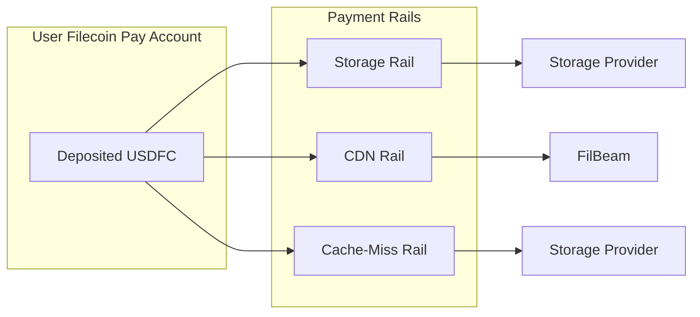
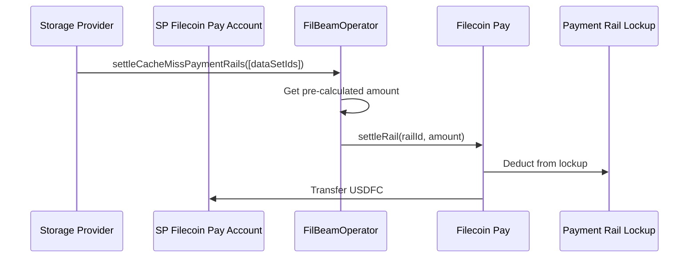
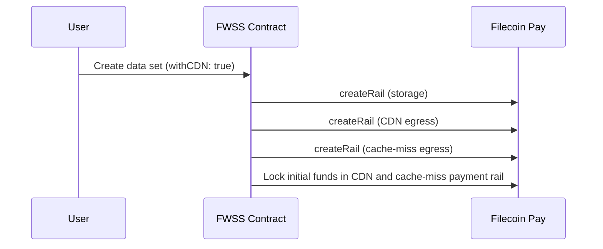
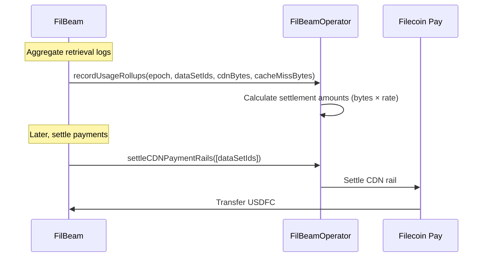
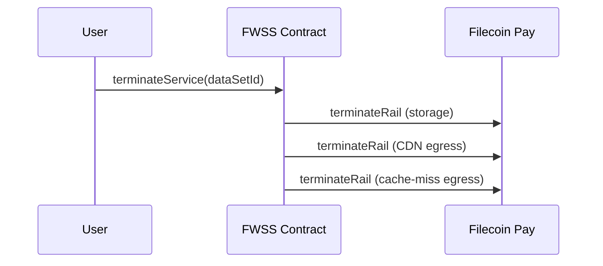

---
layout:
  width: default
  title:
    visible: true
  description:
    visible: true
  tableOfContents:
    visible: true
  outline:
    visible: true
  pagination:
    visible: true
  metadata:
    visible: true
---

# Payment Rails Reference

This reference documents how payment rails work in FilBeam as part of the Filecoin Pay system.

## What is a Payment Rail?

A payment rail is a **payment channel between a payer and recipient** with configurable terms. Rails enable automated, continuous token transfers with built-in protections through lockup mechanisms.

In FilBeam, payment rails guarantee that:
- Storage providers get paid for retrieval services
- FilBeam gets paid for CDN delivery
- Users can't consume services without sufficient funds

## FilBeam Payment Rails

When a data set is created with FilBeam enabled, three payment rails are created:

| Rail | Payer | Recipient | Pricing | Purpose |
|------|-------|-----------|---------|---------|
| Storage | User | Storage Provider | Time-based | Ongoing storage costs |
| CDN Egress | User | FilBeam | Usage-based ($7/TiB) | CDN delivery fees |
| Cache-Miss Egress | User | Storage Provider | Usage-based ($7/TiB) | Retrieval from origin |



## How Rails Work

### Lockup Mechanism

Rails use lockup to guarantee funds are available for services:

1. **Streaming Lockup** (for storage): `paymentRate × lockupPeriod`
   - Guarantees funds for rate-based payments over a pre-agreed period
   - Used for ongoing storage costs

2. **Fixed Lockup** (for egress): Reserved for egress payments
   - Used for CDN and cache-miss egress
   - Converted to quota in FilBeam's off-chain database

The lockup is a **safety mechanism, not a pre-payment**. During normal operations, payments draw from general funds. After termination, locked funds become available for final settlement.

### Settlement Process

Settlement transfers earned funds from the payment rail fixed lockup to the recipient's Filecoin Pay account:



**Key points:**
- Settlement amounts are pre-calculated during usage reporting
- Anyone can trigger settlement, but funds go to the designated recipient
- Partial settlements are supported if funds are insufficient

## Rail Lifecycle

### 1. Creation

Rails are created automatically when a data set is created with FilBeam enabled:



### 2. Top-Up

Users can add more funds to egress rails:

```javascript
import { Synapse, WarmStorageService, RPC_URLS } from '@filoz/synapse-sdk'
import { ethers } from 'ethers'

const synapse = await Synapse.create({
  privateKey: process.env.PRIVATE_KEY,
  rpcURL: RPC_URLS.calibration.http
})
const warmStorage = await WarmStorageService.create(synapse.getProvider(), synapse.getWarmStorageAddress())

const dataSetId = 3830

// Top up with $10 for CDN and $10 for cache-miss
const cdnAmount = ethers.parseUnits('10', 18)
const cacheMissAmount = ethers.parseUnits('10', 18)

const tx = await warmStorageService.topUpCDNPaymentRails(synapse.getSigner(), dataSetId, cdnAmount, cacheMissAmount)
```

This locks additional USDFC in the payment rails and emits a `CdnPaymentRailsToppedUp` event.

### 3. Usage & Settlement

As content is served, FilBeam tracks usage off-chain and periodically reports it on-chain:



Storage providers can settle their cache-miss earnings:

```javascript
await walletClient.writeContract({
  address: filBeamOperator,
  abi: filBeamOperatorAbi,
  functionName: 'settleCacheMissPaymentRails',
  args: [dataSetIds]
})
```

### 4. Termination

Users can terminate FilBeam by terminating the entire data set:

**Terminate entire service:**


After termination:
- No content from terminated data set can be served via FilBeam
- Outstanding usage can still be settled
- Remaining locked funds are released after the lockup period

## Quota vs Lockup

FilBeam converts rail lockup to quota for fast request validation:

| Concept | Location | Purpose |
|---------|----------|---------|
| **Lockup** | On-chain (Filecoin Pay) | Guarantees funds are reserved |
| **Quota** | Off-chain (FilBeam DB) | Fast request validation |

When you top up:
1. USDFC is locked in the payment rail (on-chain)
2. FilBeam calculates quota from the locked amount (off-chain)
3. Quota is decremented as content is served (off-chain)
4. Usage is reported and settled periodically (on-chain)

```
Quota (bytes) = (Locked USDFC × BYTES_PER_TIB) / RATE_PER_TIB

Where:
- BYTES_PER_TIB = 1,099,511,627,776 (1024^4)
- RATE_PER_TIB = 7 × 10^18 (USDFC with 18 decimals = $7)
```

## Filecoin Pay Account Management

### Depositing Funds

Before topping up rails, ensure you have sufficient USDFC deposited:

```javascript
import { Synapse, WarmStorageService, RPC_URLS, TOKENS } from '@filoz/synapse-sdk'
import { ethers } from 'ethers'

const synapse = await Synapse.create({
  privateKey: process.env.PRIVATE_KEY,
  rpcURL: RPC_URLS.calibration.http
})

const accountInfo = await synapse.payments.accountInfo(TOKENS.USDFC)

console.log('Available funds:', accountInfo.availableFunds)
console.log('Current lockup:', accountInfo.lockupCurrent)
```

### Withdrawing Funds

Unlocked funds can be withdrawn:

```javascript
await synapse.payments.withdraw(amount, TOKENS.USDFC)
```

**Note:** Funds locked in active payment rails cannot be withdrawn until the rail is terminated and the lockup period expires.

## Events

| Event | Contract | Description |
|-------|----------|-------------|
| `CdnPaymentRailsToppedUp` | FWSS | Funds added to CDN and cache-miss rails |
| `CdnServiceTerminated` | FWSS | FilBeam service ended for data set |
| `ServiceTerminated` | FWSS | Entire data set service ended |

## Error Handling

| Error | Cause | Solution |
|-------|-------|----------|
| Insufficient funds | Not enough USDFC deposited | Deposit more USDFC to your account |
| Insufficient unlocked funds | All funds locked in rails | Wait for settlement or terminate rails |
| Rail not found | Invalid data set ID | Verify the data set exists and has FilBeam enabled |
| Already terminated | Rail already terminated | Cannot top up terminated rails |

## See Also

- [Payment Model](../explanation/payment-model.md) - How FilBeam billing works
- [Quota System](../explanation/quota-system.md) - Understanding dual quotas
- [Top Up CDN Quota](../how-to/top-up-cdn-quota.md) - Step-by-step guide
- [Settle Payment Rails](../how-to/settle-payment-rails.md) - Claim SP earnings
- [FilBeamOperator Contract](filbeam-operator.md) - Settlement contract reference
- [Filecoin Pay Documentation](https://docs.filecoin.cloud/cookbooks/filecoin-pay/) - Full Filecoin Pay docs
