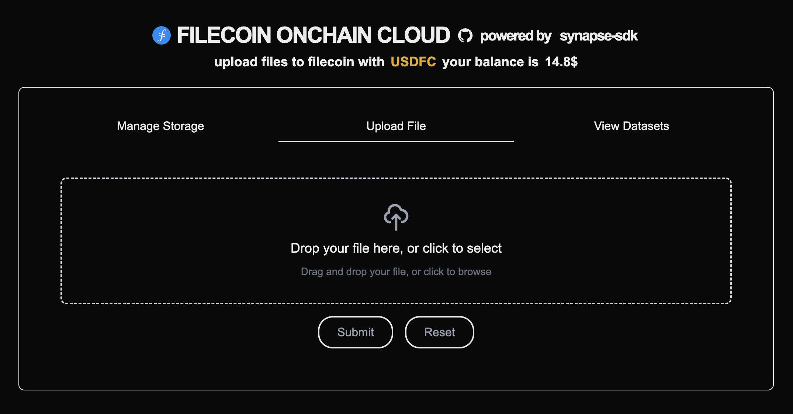

# Upload File

Once you have completed the initial setup, you can switch to the Upload File tab and drop some files into your browser to upload them to Filecoin!

<figure><figcaption></figcaption></figure>

1. If this is your first file upload, you will need to approve a CreateProofSet signature request. Filecoin PDP ProofSets are similar to Buckets you may know from Web2 storage offerings. In your wallet, check the transaction details - the `withCDN` parameter must be set to `true` in order to enable Filecoin Beam data delivery.
2. After a file is uploaded to the storage provider, it must be linked to your ProofSet. To establish the link, you need to approve an AddRoots signature request in your wallet.
3. After the blockchain confirms the transaction, your file is stored on Filecoin and ready for retrieval. Take a note of the CommP value shown in File Upload Details - that’s the CID you will use for downloads.
